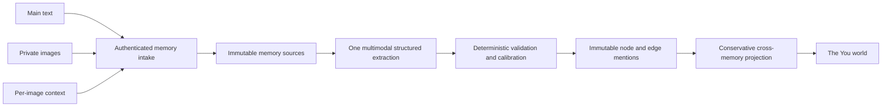

# Chapter memory-map architecture

> **Status: shipped production contract, July 29 2026.** This document
> describes the current private-upload, source-preserving `memory-map-v3`
> pipeline used by web onboarding and the shared iMessage memory path.

## Product contract

A memory can contain three independent evidence sources:

1. The main memory text.
2. One or more images.
3. Optional user-written context attached to each image.

All three are preserved separately. The generated graph is a derived view, never
the only copy of what the user shared.

The graph always has one moment anchor and may contain any meaningful subset of
the seven pillars:

- People
- Place
- Activity
- Interest
- Feeling
- Condition
- Pattern

Extraction must not fill categories for completeness. A small, well-grounded
graph is better than a large speculative one.

## Pipeline

### 1. Private ingestion

The browser uploads each image with Base44 `UploadPrivateFile`. The public graph
never receives the private file URI. The authenticated `sidequest-memory`
function validates:

- A non-empty text or image input.
- At most eight images.
- Image media types and a 25 MB per-image limit.
- Text and per-image context length limits.
- A caller-generated idempotency key.

An identical successful request returns the existing memory rather than creating
a duplicate.

### 2. Source preservation

`ExperienceMemorySource` stores each source independently:

- `text:main`
- `image:0`, `image:1`, and so on
- `context:0`, `context:1`, and so on

Graph nodes and edges store the exact source refs that support them. Images stay
private; short-lived signed URLs are created only while the extraction call is
running.

### 3. Multimodal extraction

Extraction runs as a direct OpenRouter call from `lib/memoryExtractor.ts`, not
through the Eve agent. The first memory a person ever gives is the moment the
product either works or doesn't, and it should not depend on the agent sandbox
being healthy. `google/gemini-3.1-flash-lite` runs first and
`moonshotai/kimi-k2.6` is the fallback, each under its own attempt timeout so a
stalled provider fails over instead of hanging. Both are overridable with
`CHAPTER_MEMORY_MODEL` and `CHAPTER_MEMORY_FALLBACK_MODEL`, and calls are pinned
to zero-data-retention providers.

One structured multimodal call receives:

- The main text.
- Images in a documented attachment order.
- The context mapped to each image.
- A bounded catalog of the user's existing canonical concepts.
- Recent memory summaries for possible corroboration.

The model proposes nodes, edges, evidence refs, and one of four evidence bases:

- `explicit`: directly stated by the user.
- `visible`: directly observable in an image.
- `inferred`: a careful, unresolved interpretation.
- `recurring`: a cross-memory hypothesis with cited prior support.

### 4. Deterministic trust boundary

The server validates and recalibrates the proposal before any graph rows are
written.

- Image-only evidence may establish visible people, places, and activities.
- Image-only evidence cannot establish the user's feelings, interests,
  conditions, preferences, relationships, or patterns.
- Named people are separate nodes. An image cannot supply a person's name or
  relationship unless the user wrote it.
- Sensitive traits are never inferred from pixels.
- `fact` is reserved for explicit authored evidence or narrow visible facts.
- Inferences and recurring patterns remain hypotheses.
- Confidence is capped by evidence basis.
- Every source ref must exist in the preserved input.
- Every edge endpoint must exist and self-loops are removed.
- Every retained node is connected to the moment.
- Exactly one moment anchor is required.

If extraction or persistence fails, the memory is marked failed. `getMyGraph`
only projects complete memories, so a partial attempt cannot leak into the
user's world.

### 5. Future-memory identity

Each processed memory writes immutable node and edge mentions. Existing graph
rows are never rewritten by a new extraction.

For a future memory, the model may reuse an existing canonical key only when it
is confidently the same concept. A name match alone is not enough. Ambiguous or
new concepts receive a memory-scoped key.

At read time, complete mentions with the same canonical key are projected into
one stable graph node. Their occurrence count, strongest evidence, salience,
and relationships are combined conservatively. This gives future memories a
way to deepen the world without letting a failed or weak extraction overwrite
what was already known.

Patterns are stricter than other pillars. They are accepted only when:

- The user explicitly states a general tendency in text/context; or
- The current memory plus at least one cited prior concept supports a recurring
  hypothesis.

One enjoyable memory is never automatically promoted into a preference or
personality pattern.

### 6. Read-time repair

Extraction sometimes encodes a relationship as prose instead of structure — a
node labelled "Sharing Tiramisu Cake with Halmoni", sitting unconnected to the
Halmoni person node. `lib/graphRepair.ts` is a deterministic lint that runs when
a graph is read: it links nodes that name a person to that person's node, and
trims the trailing companion clause out of the label so the relationship lives
in the graph rather than in the words.

It repairs the projection, never the stored rows. Immutable mentions stay
exactly as extracted, so the repair can be changed or removed without having
rewritten anyone's history.

## Resource boundaries

- `ExperienceMemory`: intake, idempotency, processing status, title, and summary.
- `ExperienceMemorySource`: private text/image/context evidence.
- `ExperienceGraphNode`: one immutable concept mention with its evidence basis.
- `ExperienceGraphEdge`: one immutable relationship mention with its evidence
  basis.
- `sidequest-memory`: authenticated web memory intake.
- Shared memory pipeline: the same extraction rules for web onboarding and the
  existing iMessage onboarding path.
- `sidequest-data`: complete-memory filtering and conservative graph projection.
- `lib/memoryExtractor.ts`: the extraction call itself, outside Base44 and
  outside Eve.
- `lib/graphRepair.ts`: read-time structural lint over the projection.

The graph produced here is what **Now** and **Together** plan from. Now spends
it once a week: every Saturday at 9:00 a.m. local time it opens a sealed pack of
three independently researched experiences, one small activity, one mini
adventure, and one proper adventure, and the person may reveal all three but
keep only one. That weekly choice is the main thing a private graph is *for*, so
extraction quality is felt most in what shows up on Saturday. See
[`weekly-experience-packs.md`](./weekly-experience-packs.md) for that contract.

Together reads the graph through a shareable cut — places, activities, interests
only — so the pillars this document treats as private (people, feelings,
conditions, patterns) are exactly the ones that never cross an account boundary.

## Operational versioning

Every new memory, node, and edge records `memory-map-v3`. Prompt or validation
changes should increment this version. Reprocessing should create a new derived
attempt rather than silently mutating a user's original sources.
